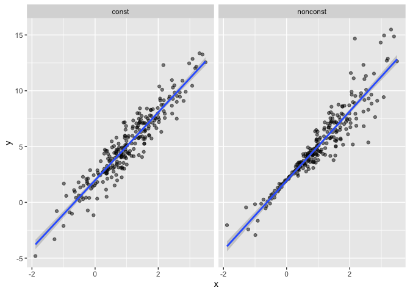
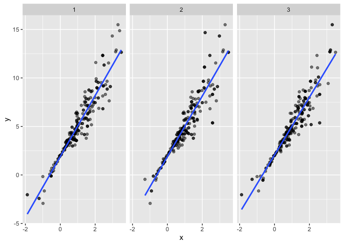
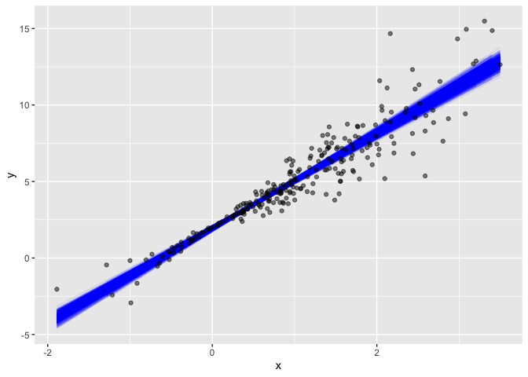

Bootstrapping
================
Jingyi Yao
2022-11-26

## Introduction to Bootstrap

Bootstrapping is a popular resampling-based approach to statistical
inference, and is helpful when usual statistical methods are intractable
or inappropriate. The idea is to **draw repeated samples** from your
original sample with **replacement**, thereby **approximating** the
repeated sampling framework. Using list columns to store bootstrap
samples is natural and provides a “tidy” approach to resampling-based
inference.

Traditionally, the **distribution of a sample statistic** (sample mean,
SLR coefficients, etc.) for repeated, random draws from a population has
been established theoretically. These **theoretical distributions** make
some **assumptions** about the **underlying population** from which
samples are drawn, or depend on **large sample sizes** for asymptotic
results. (Central Limit Theorem)

In cases where the **assumptions aren’t met**, or **sample sizes aren’t
large enough** for asymptotics to kick in, it is still necessary to make
inferences using the sample statistic. In these cases, **drawing
repeatedly from the original population** would be great – one could
simply draw a lot of samples and look at the **empirical** (rather than
theoretical) distribution.

Repeated sampling can happen on a computer though. To bootstrap, one
draws repeated samples (with the **same sample size**) from the original
sample with replacement to mimic the process of drawing repeated samples
from the population. The bootstrap samples will differ from the original
sample, and the sample statistic of interest (sample mean, SLR
coefficients, etc.) can be computed for each bootstrap sample. Looking
at the distribution of the statistic across samples gives a sense of the
uncertainty in the estimate.

## Bootstrapping in SLR

### 1. generate 2 samples

#### const sample has the same error for each y – linear regression assumption

#### nonconst sample has different error for each y

``` r
n_samp = 250

sim_df_const = 
  tibble(
    x = rnorm(n_samp, 1, 1),
    error = rnorm(n_samp, 0, 1),
    y = 2 + 3 * x + error
  )

sim_df_nonconst = sim_df_const %>% 
  mutate(
  error = error * .75 * x,
  y = 2 + 3 * x + error
)
```

### 2. bind the 2 samples

#### `bind_rows(.id = "new column", a = df1, b = df2)` a and b are in new column

``` r
sim_df = 
  bind_rows(const = sim_df_const, nonconst = sim_df_nonconst, .id = "data_source") 

sim_df
```

    ## # A tibble: 500 × 4
    ##    data_source     x   error     y
    ##    <chr>       <dbl>   <dbl> <dbl>
    ##  1 const       0.374  0.136   3.26
    ##  2 const       1.18   0.407   5.96
    ##  3 const       0.164 -0.0697  2.42
    ##  4 const       2.60  -0.248   9.54
    ##  5 const       1.33   0.696   6.68
    ##  6 const       0.180  1.15    3.68
    ##  7 const       1.49  -2.40    4.06
    ##  8 const       1.74   0.573   7.79
    ##  9 const       1.58   0.375   7.10
    ## 10 const       0.695 -0.425   3.66
    ## # … with 490 more rows

### 3. plot the fitted line using `+ stat_smooth(method = "lm")`

``` r
sim_df %>% 
  ggplot(aes(x = x, y = y)) + 
  geom_point(alpha = .5) +
  stat_smooth(method = "lm") +
  facet_grid(~data_source) 
```

    ## `geom_smooth()` using formula 'y ~ x'

<!-- -->

These datasets have roughly the same overall variance, but the left
panel shows data with constant variance and the **right panel** shows
data with **non-constant variance**. For this reason, ordinary least
squares should provide reasonable estimates in both cases, but inference
is standard inference approaches may only be justified for the data on
the left.

### 4. compare the SLR model results

``` r
lm(y ~ x, data = sim_df_const) %>% 
  broom::tidy() %>% 
  knitr::kable(digits = 3)
```

| term        | estimate | std.error | statistic | p.value |
|:------------|---------:|----------:|----------:|--------:|
| (Intercept) |    1.977 |     0.098 |    20.157 |       0 |
| x           |    3.045 |     0.070 |    43.537 |       0 |

``` r
lm(y ~ x, data = sim_df_nonconst) %>% 
  broom::tidy() %>% 
  knitr::kable(digits = 3)
```

| term        | estimate | std.error | statistic | p.value |
|:------------|---------:|----------:|----------:|--------:|
| (Intercept) |    1.934 |     0.105 |    18.456 |       0 |
| x           |    3.112 |     0.075 |    41.661 |       0 |

standard errors for coefficient estimates are similar in both cases.

## Drawing one bootstrap sample

### 1. write a function to do bootstrap

#### the original df is the argument

#### the output is the sample from the original df draw with replacement

``` r
boot_sample = function(df) {
  sample_frac(df, replace = TRUE)
}
```

### 2. draw the bootstrap result and fit the model using `lm`

#### set the **alpha parameter** to show the overlapping points

``` r
boot_sample(sim_df_nonconst) %>% 
  ggplot(aes(x = x, y = y)) + 
  geom_point(alpha = .5) +  # set the alpha to show if points are overlapped
  stat_smooth(method = "lm")
```

    ## `geom_smooth()` using formula 'y ~ x'

<!-- -->

n comparison with the original data, the bootstrap sample has the same
characteristics but isn’t a perfect duplicate – some original data
points **appear more than once**, others **don’t appear at all**.

## Drawing many bootstrap samples

### 1. create a df to store the 1000 bootstrapped samples

#### `data_frame(column1, column2)` to create a df

#### `rerun(n = times, boot_sample(original df))` bootstrap for n times

#### `rerun(times, function())` rerun the sample function on the same argument for n times, the output is **listcol**

``` r
boot_straps = 
  data_frame(
    strap_number = 1:1000,
    strap_sample = rerun(1000, boot_sample(sim_df_nonconst))
  )
```

    ## Warning: `data_frame()` was deprecated in tibble 1.1.0.
    ## Please use `tibble()` instead.
    ## This warning is displayed once every 8 hours.
    ## Call `lifecycle::last_lifecycle_warnings()` to see where this warning was generated.

``` r
boot_straps
```

    ## # A tibble: 1,000 × 2
    ##    strap_number strap_sample      
    ##           <int> <list>            
    ##  1            1 <tibble [250 × 3]>
    ##  2            2 <tibble [250 × 3]>
    ##  3            3 <tibble [250 × 3]>
    ##  4            4 <tibble [250 × 3]>
    ##  5            5 <tibble [250 × 3]>
    ##  6            6 <tibble [250 × 3]>
    ##  7            7 <tibble [250 × 3]>
    ##  8            8 <tibble [250 × 3]>
    ##  9            9 <tibble [250 × 3]>
    ## 10           10 <tibble [250 × 3]>
    ## # … with 990 more rows

### 2. **arrange** the sample and **pull** them out of the listcol

``` r
boot_straps %>% 
  filter(strap_number %in% 1:2) %>% 
  mutate(strap_sample = map(strap_sample, ~arrange(.x, x))) %>% 
  pull(strap_sample)
```

    ## [[1]]
    ## # A tibble: 250 × 3
    ##         x   error       y
    ##     <dbl>   <dbl>   <dbl>
    ##  1 -1.89   1.62   -2.04  
    ##  2 -1.89   1.62   -2.04  
    ##  3 -1.21  -0.781  -2.43  
    ##  4 -1.21  -0.781  -2.43  
    ##  5 -1.00   0.832  -0.169 
    ##  6 -0.989 -1.97   -2.93  
    ##  7 -0.914 -0.908  -1.65  
    ##  8 -0.606 -0.106   0.0774
    ##  9 -0.536  0.0227  0.413 
    ## 10 -0.524 -0.536  -0.106 
    ## # … with 240 more rows
    ## 
    ## [[2]]
    ## # A tibble: 250 × 3
    ##         x  error       y
    ##     <dbl>  <dbl>   <dbl>
    ##  1 -1.29   1.40  -0.454 
    ##  2 -0.989 -1.97  -2.93  
    ##  3 -0.914 -0.908 -1.65  
    ##  4 -0.914 -0.908 -1.65  
    ##  5 -0.805  0.292 -0.123 
    ##  6 -0.805  0.292 -0.123 
    ##  7 -0.665 -0.544 -0.539 
    ##  8 -0.641 -0.416 -0.338 
    ##  9 -0.606 -0.106  0.0774
    ## 10 -0.606 -0.106  0.0774
    ## # … with 240 more rows

### 3. **unnest** the listcol before plotting

``` r
boot_straps %>% 
  filter(strap_number %in% 1:3) %>% 
  unnest(strap_sample) %>% 
  ggplot(aes(x = x, y = y)) + 
  geom_point(alpha = .5) +
  stat_smooth(method = "lm", se = FALSE) +
  facet_grid(~strap_number) 
```

    ## `geom_smooth()` using formula 'y ~ x'

<!-- -->

This shows some of the differences across bootstrap samples, and shows
that the fitted regression lines aren’t the same for every bootstrap
sample.

## Analyzing bootstrap samples

### 1. result is based on model

#### delete sample and model before return the result

#### the output of `map()` is **listcol** – need to unnest() before the output

``` r
bootstrap_results = 
  boot_straps %>% 
  mutate(
    models = map(strap_sample, ~lm(y ~ x, data = .x) ),
    results = map(models, broom::tidy)) %>%  # use broom::tidy for each listcol model
  select(-strap_sample, -models) %>%  #  model is just a tool column
  unnest(results) 

bootstrap_results
```

    ## # A tibble: 2,000 × 6
    ##    strap_number term        estimate std.error statistic   p.value
    ##           <int> <chr>          <dbl>     <dbl>     <dbl>     <dbl>
    ##  1            1 (Intercept)     1.90    0.0982      19.3 2.45e- 51
    ##  2            1 x               3.14    0.0688      45.6 1.18e-122
    ##  3            2 (Intercept)     1.89    0.118       16.0 4.78e- 40
    ##  4            2 x               3.12    0.0843      37.0 5.32e-103
    ##  5            3 (Intercept)     2.06    0.0976      21.1 3.71e- 57
    ##  6            3 x               2.97    0.0690      43.1 2.89e-117
    ##  7            4 (Intercept)     2.04    0.102       20.0 9.03e- 54
    ##  8            4 x               3.03    0.0699      43.3 1.43e-117
    ##  9            5 (Intercept)     1.90    0.113       16.8 1.01e- 42
    ## 10            5 x               3.18    0.0772      41.2 7.18e-113
    ## # … with 1,990 more rows

``` r
bootstrap_results %>% 
  group_by(term) %>% 
  summarize(boot_se = sd(estimate)) %>% 
  knitr::kable(digits = 3)
```

| term        | boot_se |
|:------------|--------:|
| (Intercept) |   0.075 |
| x           |   0.101 |

``` r
bootstrap_results %>% 
  group_by(term) %>% 
  summarize(
    ci_lower = quantile(estimate, 0.025), 
    ci_upper = quantile(estimate, 0.975))
```

    ## # A tibble: 2 × 3
    ##   term        ci_lower ci_upper
    ##   <chr>          <dbl>    <dbl>
    ## 1 (Intercept)     1.79     2.08
    ## 2 x               2.91     3.31

``` r
boot_straps %>% 
  unnest(strap_sample) %>% 
  ggplot(aes(x = x, y = y)) + 
  geom_line(aes(group = strap_number), stat = "smooth", method = "lm", se = FALSE, alpha = .1, color = "blue") +
  geom_point(data = sim_df_nonconst, alpha = .5)
```

    ## `geom_smooth()` using formula 'y ~ x'

<!-- -->

## bootstrap in modelr
