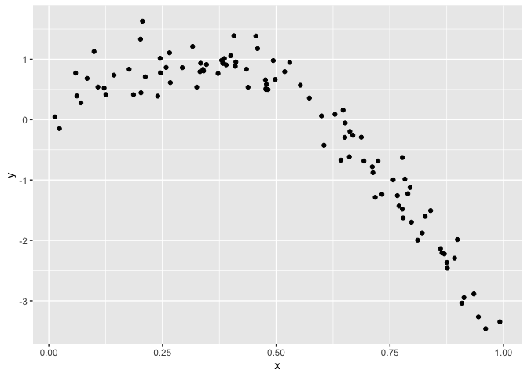
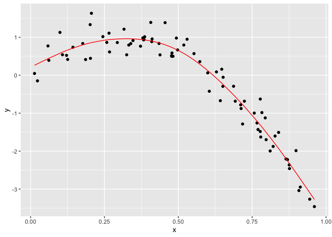
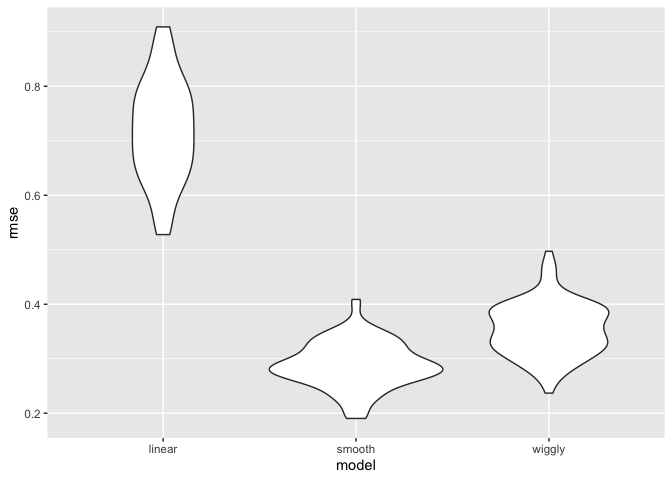

cross validation
================
Jingyi Yao
2022-11-25

``` r
library(tidyverse)
library(modelr)
library(mgcv)

set.seed(1)
```

## CV “by hand”

### 1. generate a non-linear df

``` r
nonlin_df = 
  tibble(
    id = 1:100,
    x = runif(100, 0, 1),
    y = 1 - 10 * (x - .3) ^ 2 + rnorm(100, 0, .3)
  )

nonlin_df %>% 
  ggplot(aes(x = x, y = y)) + 
  geom_point()
```

<!-- -->

### 2. split data into **training** and **testing**

#### `sample_n(df,n=.)` sample from the df with a sample size as argument

#### `anti_join(df,df1,by="id")` get the complement of a df1 in df, by “column name”

#### use 2 geom_point, the second one should claim the df

``` r
train_df = sample_n(nonlin_df, 80)                  # sample from the df
test_df = anti_join(nonlin_df, train_df, by = "id") # get the complement

ggplot(train_df, aes(x = x, y = y)) + 
  geom_point() + 
  geom_point(data = test_df, color = "red")  # 2 geom_point()
```

<!-- -->

### 3. fit 3 models using the **training** data

#### `gam(y ~ s(x), data = training)` fit smooth model

#### `gam(y ~ s(x,k), sp, data = training)` sp = smoothing parameter fit wiggly model

``` r
linear_mod = lm(y ~ x, data = train_df)
smooth_mod = mgcv::gam(y ~ s(x), data = train_df)
wiggly_mod = mgcv::gam(y ~ s(x, k = 30), sp = 10e-6, data = train_df)
```

### 4. the smooth model

#### `add_predictions(model name)` to add `pred` to the training df

``` r
train_df %>% 
  add_predictions(smooth_mod) %>% 
  ggplot(aes(x = x, y = y)) + geom_point() + 
  geom_line(aes(y = pred), color = "red")
```

<!-- -->

### 5. the wiggly model

``` r
train_df %>% 
  add_predictions(wiggly_mod) %>% 
  ggplot(aes(x = x, y = y)) + geom_point() + 
  geom_line(aes(y = pred), color = "red")
```

<!-- -->

### 6. show the 3 models together

#### `gather_predictions(fit1,fit2,fit3)` adds column : `model` and `pred`

``` r
train_df %>% 
  gather_predictions(linear_mod, smooth_mod, wiggly_mod) %>% 
  mutate(model = fct_inorder(model)) %>% 
  ggplot(aes(x = x, y = y)) + 
  geom_point() + 
  geom_line(aes(y = pred), color = "red") + 
  facet_wrap(~model)
```

<!-- -->

### 7. compute root mean squared errors **RMSE** for each model

#### **median absolute deviation** is a common outcome measure as well, used in `modelr`

``` r
rmse(linear_mod, test_df)
```

    ## [1] 0.7052956

``` r
rmse(smooth_mod, test_df)
```

    ## [1] 0.2221774

``` r
rmse(wiggly_mod, test_df)
```

    ## [1] 0.289051

## CV using modelr

### 1. `crossv_mc` to split the df into train and test for 100 times

#### **train** is a listcol and **test** is another listcol

``` r
cv_df = 
  crossv_mc(nonlin_df, 100) 

cv_df
```

    ## # A tibble: 100 × 3
    ##    train               test                .id  
    ##    <list>              <list>              <chr>
    ##  1 <resample [79 x 3]> <resample [21 x 3]> 001  
    ##  2 <resample [79 x 3]> <resample [21 x 3]> 002  
    ##  3 <resample [79 x 3]> <resample [21 x 3]> 003  
    ##  4 <resample [79 x 3]> <resample [21 x 3]> 004  
    ##  5 <resample [79 x 3]> <resample [21 x 3]> 005  
    ##  6 <resample [79 x 3]> <resample [21 x 3]> 006  
    ##  7 <resample [79 x 3]> <resample [21 x 3]> 007  
    ##  8 <resample [79 x 3]> <resample [21 x 3]> 008  
    ##  9 <resample [79 x 3]> <resample [21 x 3]> 009  
    ## 10 <resample [79 x 3]> <resample [21 x 3]> 010  
    ## # … with 90 more rows

### 2. create a tibble for `gam()` – the listcol’s item is a tibble

#### `as_tibble(listcol item)` change the list column items into tibbles

#### `map(listcol,as_tibble)` run `as_tibble` on each listcol item

``` r
# example with the first list column item
cv_df %>% pull(train) %>% .[[1]] %>% as_tibble
```

    ## # A tibble: 79 × 3
    ##       id      x       y
    ##    <int>  <dbl>   <dbl>
    ##  1     1 0.266   1.11  
    ##  2     2 0.372   0.764 
    ##  3     3 0.573   0.358 
    ##  4     4 0.908  -3.04  
    ##  5     6 0.898  -1.99  
    ##  6     7 0.945  -3.27  
    ##  7     8 0.661  -0.615 
    ##  8     9 0.629   0.0878
    ##  9    10 0.0618  0.392 
    ## 10    11 0.206   1.63  
    ## # … with 69 more rows

``` r
cv_df %>% pull(test) %>% .[[1]] %>% as_tibble
```

    ## # A tibble: 21 × 3
    ##       id      x      y
    ##    <int>  <dbl>  <dbl>
    ##  1     5 0.202   1.33 
    ##  2    12 0.177   0.836
    ##  3    19 0.380   0.982
    ##  4    22 0.212   0.710
    ##  5    28 0.382   0.932
    ##  6    31 0.482   0.498
    ##  7    37 0.794  -1.12 
    ##  8    42 0.647   0.158
    ##  9    47 0.0233 -0.148
    ## 10    56 0.0995  1.13 
    ## # … with 11 more rows

``` r
# using map() for each item in the list column
cv_df =
  cv_df %>% 
  mutate(
    train = map(train, as_tibble), # pull the list column and make it a tibble
    test = map(test, as_tibble))

cv_df # the items in the listcol are tibbles
```

    ## # A tibble: 100 × 3
    ##    train             test              .id  
    ##    <list>            <list>            <chr>
    ##  1 <tibble [79 × 3]> <tibble [21 × 3]> 001  
    ##  2 <tibble [79 × 3]> <tibble [21 × 3]> 002  
    ##  3 <tibble [79 × 3]> <tibble [21 × 3]> 003  
    ##  4 <tibble [79 × 3]> <tibble [21 × 3]> 004  
    ##  5 <tibble [79 × 3]> <tibble [21 × 3]> 005  
    ##  6 <tibble [79 × 3]> <tibble [21 × 3]> 006  
    ##  7 <tibble [79 × 3]> <tibble [21 × 3]> 007  
    ##  8 <tibble [79 × 3]> <tibble [21 × 3]> 008  
    ##  9 <tibble [79 × 3]> <tibble [21 × 3]> 009  
    ## 10 <tibble [79 × 3]> <tibble [21 × 3]> 010  
    ## # … with 90 more rows

### 3. fit 3 models and calculate the **RMSE** for each

#### use `map(.x = train, ~model function(y~x,data = .x))` to get the model result

#### use `map2_dbl(.x = model,.y = test,~rsme(model = .x, data = .y))` to get the rmse result

``` r
cv_df = 
  cv_df %>% 
  mutate(
    linear_mod  = map(train, ~lm(y ~ x, data = .x)),
    smooth_mod  = map(train, ~mgcv::gam(y ~ s(x), data = .x)),
    wiggly_mod  = map(train, ~gam(y ~ s(x, k = 30), sp = 10e-6, data = .x))) %>% 
  mutate(
    rmse_linear = map2_dbl(linear_mod, test, ~rmse(model = .x, data = .y)),
    rmse_smooth = map2_dbl(smooth_mod, test, ~rmse(model = .x, data = .y)),
    rmse_wiggly = map2_dbl(wiggly_mod, test, ~rmse(model = .x, data = .y)))

cv_df
```

    ## # A tibble: 100 × 9
    ##    train    test     .id   linear_mod smooth_mod wiggl…¹ rmse_…² rmse_…³ rmse_…⁴
    ##    <list>   <list>   <chr> <list>     <list>     <list>    <dbl>   <dbl>   <dbl>
    ##  1 <tibble> <tibble> 001   <lm>       <gam>      <gam>     0.675   0.298   0.375
    ##  2 <tibble> <tibble> 002   <lm>       <gam>      <gam>     0.655   0.336   0.377
    ##  3 <tibble> <tibble> 003   <lm>       <gam>      <gam>     0.785   0.295   0.337
    ##  4 <tibble> <tibble> 004   <lm>       <gam>      <gam>     0.874   0.263   0.395
    ##  5 <tibble> <tibble> 005   <lm>       <gam>      <gam>     0.784   0.250   0.341
    ##  6 <tibble> <tibble> 006   <lm>       <gam>      <gam>     0.844   0.324   0.356
    ##  7 <tibble> <tibble> 007   <lm>       <gam>      <gam>     0.791   0.274   0.349
    ##  8 <tibble> <tibble> 008   <lm>       <gam>      <gam>     0.758   0.310   0.468
    ##  9 <tibble> <tibble> 009   <lm>       <gam>      <gam>     0.621   0.287   0.409
    ## 10 <tibble> <tibble> 010   <lm>       <gam>      <gam>     0.839   0.338   0.396
    ## # … with 90 more rows, and abbreviated variable names ¹​wiggly_mod,
    ## #   ²​rmse_linear, ³​rmse_smooth, ⁴​rmse_wiggly

### 4. plot and compare the RMSE

#### `select(starts_with("rmse"))` select the rmse columns

#### make the result longer by categorizing the model and store the values in rmse

``` r
cv_df %>% 
  select(starts_with("rmse")) %>%  # select the column starts_with string
  pivot_longer(
    everything(),
    names_to = "model", 
    values_to = "rmse",
    names_prefix = "rmse_") %>% 
  mutate(model = fct_inorder(model)) %>% 
  ggplot(aes(x = model, y = rmse)) + geom_violin()
```

<!-- -->

### piece-wise linear model
