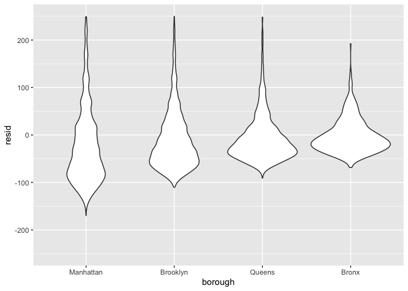
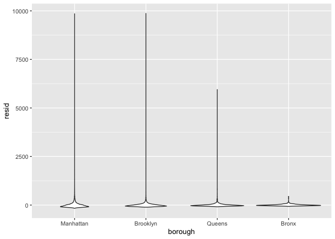

linear_models
================
Jingyi Yao
2022-11-24

 
## Model Fitting

-   interactions between variables can be specified using `*`.
-   intercept-only model `outcome ~ 1`
-   a model with no intercept `outcome ~ 0 + preidctors`
-   model using all available predictors `outcome ~ .` using the dot `.`
    to represent variables

``` r
data("nyc_airbnb")

nyc_airbnb = 
  nyc_airbnb %>% 
  mutate(stars = review_scores_location / 2) %>% 
  rename(
    borough = neighbourhood_group,
    neighborhood = neighbourhood) %>% 
  filter(borough != "Staten Island") %>% 
  select(price, stars, borough, neighborhood, room_type)

nyc_airbnb
```

    ## # A tibble: 40,492 × 5
    ##    price stars borough neighborhood room_type      
    ##    <dbl> <dbl> <chr>   <chr>        <chr>          
    ##  1    99   5   Bronx   City Island  Private room   
    ##  2   200  NA   Bronx   City Island  Private room   
    ##  3   300  NA   Bronx   City Island  Entire home/apt
    ##  4   125   5   Bronx   City Island  Entire home/apt
    ##  5    69   5   Bronx   City Island  Private room   
    ##  6   125   5   Bronx   City Island  Entire home/apt
    ##  7    85   5   Bronx   City Island  Entire home/apt
    ##  8    39   4.5 Bronx   Allerton     Private room   
    ##  9    95   5   Bronx   Allerton     Entire home/apt
    ## 10   125   4.5 Bronx   Allerton     Entire home/apt
    ## # … with 40,482 more rows

 
### 1. regression with categorical predictors(covariates)

R will treat **categorical covariates** appropriately and predictably:

**indicator variables** are created for each **non-reference** category
and included in your model, and the factor level is treated as the
reference.

##### `borough` is a categorical predictor

##### the `intercept` term is the **reference group** – `Bronx` in this example

``` r
fit = lm(price ~ stars + borough, data = nyc_airbnb)
fit
```

    ## 
    ## Call:
    ## lm(formula = price ~ stars + borough, data = nyc_airbnb)
    ## 
    ## Coefficients:
    ##      (Intercept)             stars   boroughBrooklyn  boroughManhattan  
    ##           -70.41             31.99             40.50             90.25  
    ##    boroughQueens  
    ##            13.21

 
### 2. reorder factors: change the categorical covariate order/ change reference group

#### using `fct_infreq()` reorder the categories by frequency

#### the refence group is `Manhattan` now.

changing reference categories won’t change “fit” or statistical
significance, but can affect ease of interpretation.

``` r
nyc_airbnb = 
  nyc_airbnb %>% 
  mutate(
    borough = fct_infreq(borough),      # reorder factor levels by frequency
    room_type = fct_infreq(room_type))


fit = lm(price ~ stars + borough, data = nyc_airbnb)

fit
```

    ## 
    ## Call:
    ## lm(formula = price ~ stars + borough, data = nyc_airbnb)
    ## 
    ## Coefficients:
    ##     (Intercept)            stars  boroughBrooklyn    boroughQueens  
    ##           19.84            31.99           -49.75           -77.05  
    ##    boroughBronx  
    ##          -90.25

 
 
## Tidying output

### 1. Type of `fit`

#### The output of a `lm` is an object of **class lm** which is a **list**

#### It is not a df but that can be manipulated using other functions.

``` r
fit
```

    ## 
    ## Call:
    ## lm(formula = price ~ stars + borough, data = nyc_airbnb)
    ## 
    ## Coefficients:
    ##     (Intercept)            stars  boroughBrooklyn    boroughQueens  
    ##           19.84            31.99           -49.75           -77.05  
    ##    boroughBronx  
    ##          -90.25

``` r
typeof(fit)
```

    ## [1] "list"

 
### 2. The type of `summary(fit)`

#### summary produces an object of **class summary.lm**, which is also a **list**

``` r
summary(fit)
```

    ## 
    ## Call:
    ## lm(formula = price ~ stars + borough, data = nyc_airbnb)
    ## 
    ## Residuals:
    ##    Min     1Q Median     3Q    Max 
    ## -169.8  -64.0  -29.0   20.2 9870.0 
    ## 
    ## Coefficients:
    ##                 Estimate Std. Error t value Pr(>|t|)    
    ## (Intercept)       19.839     12.189   1.628    0.104    
    ## stars             31.990      2.527  12.657   <2e-16 ***
    ## boroughBrooklyn  -49.754      2.235 -22.262   <2e-16 ***
    ## boroughQueens    -77.048      3.727 -20.675   <2e-16 ***
    ## boroughBronx     -90.254      8.567 -10.534   <2e-16 ***
    ## ---
    ## Signif. codes:  0 '***' 0.001 '**' 0.01 '*' 0.05 '.' 0.1 ' ' 1
    ## 
    ## Residual standard error: 181.5 on 30525 degrees of freedom
    ##   (9962 observations deleted due to missingness)
    ## Multiple R-squared:  0.03423,    Adjusted R-squared:  0.03411 
    ## F-statistic: 270.5 on 4 and 30525 DF,  p-value: < 2.2e-16

``` r
typeof(summary(fit))
```

    ## [1] "list"

 
### 3. `coef()` and `fitted.values()`function’s output is a **vector**

`coef` produces a vector of coefficient values

`fitted.values` is a vector of fitted values.

 
### 4. `broom` package can tidy up the `fit` result

The broom package has functions for obtaining a quick summary of the
model and for cleaning up the coefficient table.

 
### 5. `broom::glance` produce a tibble of statistics

#### select certain terms(columns) from the tibble (df)

``` r
fit %>% 
  broom::glance()
```

    ## # A tibble: 1 × 12
    ##   r.squared adj.r.…¹ sigma stati…²   p.value    df  logLik    AIC    BIC devia…³
    ##       <dbl>    <dbl> <dbl>   <dbl>     <dbl> <dbl>   <dbl>  <dbl>  <dbl>   <dbl>
    ## 1    0.0342   0.0341  182.    271. 6.73e-229     4 -2.02e5 4.04e5 4.04e5  1.01e9
    ## # … with 2 more variables: df.residual <int>, nobs <int>, and abbreviated
    ## #   variable names ¹​adj.r.squared, ²​statistic, ³​deviance

``` r
fit %>% 
  broom::glance() %>% 
  select(AIC)           # select a column    
```

    ## # A tibble: 1 × 1
    ##       AIC
    ##     <dbl>
    ## 1 404237.

 
### 6. `broom::tidy` produce a tibble for each term in the regression

broom::tidy works with lots of things, including most of the functions
for model fitting you’re likely to run into (survival, mixed models,
additive models, …).

``` r
fit %>% 
  broom::tidy()
```

    ## # A tibble: 5 × 5
    ##   term            estimate std.error statistic   p.value
    ##   <chr>              <dbl>     <dbl>     <dbl>     <dbl>
    ## 1 (Intercept)         19.8     12.2       1.63 1.04e-  1
    ## 2 stars               32.0      2.53     12.7  1.27e- 36
    ## 3 boroughBrooklyn    -49.8      2.23    -22.3  6.32e-109
    ## 4 boroughQueens      -77.0      3.73    -20.7  2.58e- 94
    ## 5 boroughBronx       -90.3      8.57    -10.5  6.64e- 26

 
### 7.`str_replace(string, pattern, replacement)`

#### change the charater string format when they have a uniform format

#### pattern is the shared part in the strings

#### replacement is what you want to fill in to replace the previous pattern

``` r
fit %>% 
  broom::tidy() %>% 
  select(term, estimate, p.value) %>% 
  mutate(term = str_replace(term, "borough", "Borough: ")) %>% 
  knitr::kable(digits = 3)
```

| term              | estimate | p.value |
|:------------------|---------:|--------:|
| (Intercept)       |   19.839 |   0.104 |
| stars             |   31.990 |   0.000 |
| Borough: Brooklyn |  -49.754 |   0.000 |
| Borough: Queens   |  -77.048 |   0.000 |
| Borough: Bronx    |  -90.254 |   0.000 |

 
 
## Diagnostics

The `modelr` package can be used to **add residuals** and **fitted
values** to a df.

### 1. `add_residuals(data,fit)`

#### arguments are the original data and the fitted model

#### add a column named `resid`

``` r
modelr::add_residuals(nyc_airbnb, fit)
```

    ## # A tibble: 40,492 × 6
    ##    price stars borough neighborhood room_type        resid
    ##    <dbl> <dbl> <fct>   <chr>        <fct>            <dbl>
    ##  1    99   5   Bronx   City Island  Private room      9.47
    ##  2   200  NA   Bronx   City Island  Private room     NA   
    ##  3   300  NA   Bronx   City Island  Entire home/apt  NA   
    ##  4   125   5   Bronx   City Island  Entire home/apt  35.5 
    ##  5    69   5   Bronx   City Island  Private room    -20.5 
    ##  6   125   5   Bronx   City Island  Entire home/apt  35.5 
    ##  7    85   5   Bronx   City Island  Entire home/apt  -4.53
    ##  8    39   4.5 Bronx   Allerton     Private room    -34.5 
    ##  9    95   5   Bronx   Allerton     Entire home/apt   5.47
    ## 10   125   4.5 Bronx   Allerton     Entire home/apt  51.5 
    ## # … with 40,482 more rows

 
### 2. `add_predictions(data,fit)`

#### arguments are the original data and the fitted model

#### add a column named `pred`

``` r
modelr::add_predictions(nyc_airbnb, fit)
```

    ## # A tibble: 40,492 × 6
    ##    price stars borough neighborhood room_type        pred
    ##    <dbl> <dbl> <fct>   <chr>        <fct>           <dbl>
    ##  1    99   5   Bronx   City Island  Private room     89.5
    ##  2   200  NA   Bronx   City Island  Private room     NA  
    ##  3   300  NA   Bronx   City Island  Entire home/apt  NA  
    ##  4   125   5   Bronx   City Island  Entire home/apt  89.5
    ##  5    69   5   Bronx   City Island  Private room     89.5
    ##  6   125   5   Bronx   City Island  Entire home/apt  89.5
    ##  7    85   5   Bronx   City Island  Entire home/apt  89.5
    ##  8    39   4.5 Bronx   Allerton     Private room     73.5
    ##  9    95   5   Bronx   Allerton     Entire home/apt  89.5
    ## 10   125   4.5 Bronx   Allerton     Entire home/apt  73.5
    ## # … with 40,482 more rows

 
### 3. plot : covariate vs. residuals

#### ggplot()+geom()+ ylim(lowerbound,upperbound) add a y limit

``` r
nyc_airbnb %>% 
  modelr::add_residuals(fit) %>% 
  ggplot(aes(x = borough, y = resid)) + geom_violin() +
  ylim(-250,250)
```

    ## Warning: Removed 10862 rows containing non-finite values (stat_ydensity).

<!-- -->

 
``` r
nyc_airbnb %>% 
  modelr::add_residuals(fit) %>% 
  ggplot(aes(x = stars, y = resid)) + geom_point()
```

    ## Warning: Removed 9962 rows containing missing values (geom_point).

<!-- -->

the presence of extremely large outliers in price and a generally skewed
residual distribution. There are a few things we might try to do here –
including creating a formal rule for the exclusion of outliers,
transforming the price variable (e.g. using a log transformation), or
fitting a model that is robust to outliers.

 
 
## Hypothesis testing

### 1. compare the nested models

#### null hypothesis : the smaller model is better

#### alternative hypothesis : the bigger model is better

``` r
fit_null = lm(price ~ stars + borough, data = nyc_airbnb)             # smaller model
fit_alt = lm(price ~ stars + borough + room_type, data = nyc_airbnb)  # bigger model
```

 
### 2. use `anova(small,big)` to test the models

#### that this works for **nested** models only.

#### Comparing **non-nested** models is a common problem that requires other methods;

#### **cross validation** may be helpful

``` r
anova(fit_null, fit_alt) %>% 
  broom::tidy()
```

    ## Warning: Unknown or uninitialised column: `term`.

    ## # A tibble: 2 × 7
    ##   term                              df.re…¹    rss    df   sumsq stati…² p.value
    ##   <chr>                               <dbl>  <dbl> <dbl>   <dbl>   <dbl>   <dbl>
    ## 1 price ~ stars + borough             30525 1.01e9    NA NA          NA       NA
    ## 2 price ~ stars + borough + room_t…   30523 9.21e8     2  8.42e7   1394.       0
    ## # … with abbreviated variable names ¹​df.residual, ²​statistic

 
 
## Nesting data

#### use nest to create a list column containing datasets and fit separate models to each

#### nest within boroughs and fit borough-specific models

 
### 1. `nest(data = - category column)`

#### get a df for each category (df under each category)

#### each category is now a list column that can be the argument for map()

 
### 2. nest boroughs in NYC

#### `unest(results)` release the list columns for each category

``` r
nest_lm_res =
  nyc_airbnb %>% 
  nest(df = -borough) %>%   # combine the columns except borough as a list
  mutate(
    models = map(.x = df, ~lm(price ~ stars + room_type, data = .x)), 
    results = map(models, broom::tidy)) %>%  # mao(listcol)
  select(-df, -models) %>%  # eliminate some tool columns only useful during the process
  unnest(results)   

nest_lm_res 
```

    ## # A tibble: 16 × 6
    ##    borough   term                  estimate std.error statistic   p.value
    ##    <fct>     <chr>                    <dbl>     <dbl>     <dbl>     <dbl>
    ##  1 Bronx     (Intercept)              90.1      15.2       5.94 5.73e-  9
    ##  2 Bronx     stars                     4.45      3.35      1.33 1.85e-  1
    ##  3 Bronx     room_typePrivate room   -52.9       3.57    -14.8  6.21e- 41
    ##  4 Bronx     room_typeShared room    -70.5       8.36     -8.44 4.16e- 16
    ##  5 Queens    (Intercept)              91.6      25.8       3.54 4.00e-  4
    ##  6 Queens    stars                     9.65      5.45      1.77 7.65e-  2
    ##  7 Queens    room_typePrivate room   -69.3       4.92    -14.1  1.48e- 43
    ##  8 Queens    room_typeShared room    -95.0      11.3      -8.43 5.52e- 17
    ##  9 Brooklyn  (Intercept)              69.6      14.0       4.96 7.27e-  7
    ## 10 Brooklyn  stars                    21.0       2.98      7.05 1.90e- 12
    ## 11 Brooklyn  room_typePrivate room   -92.2       2.72    -34.0  6.40e-242
    ## 12 Brooklyn  room_typeShared room   -106.        9.43    -11.2  4.15e- 29
    ## 13 Manhattan (Intercept)              95.7      22.2       4.31 1.62e-  5
    ## 14 Manhattan stars                    27.1       4.59      5.91 3.45e-  9
    ## 15 Manhattan room_typePrivate room  -124.        3.46    -35.8  9.40e-270
    ## 16 Manhattan room_typeShared room   -154.       10.1     -15.3  2.47e- 52

 
### 3. `fct_inorder(term)` reorder the factors by the order in which they first appear

#### pivot_wider to change the model of each borough into one line

``` r
nest_lm_res %>% 
  select(borough, term, estimate) %>% 
  mutate(term = fct_inorder(term)) %>% 
  pivot_wider(
    names_from = term, values_from = estimate) %>%  # longer changed into wider
  knitr::kable(digits = 3)
```

| borough   | (Intercept) |  stars | room_typePrivate room | room_typeShared room |
|:----------|------------:|-------:|----------------------:|---------------------:|
| Bronx     |      90.067 |  4.446 |               -52.915 |              -70.547 |
| Queens    |      91.575 |  9.654 |               -69.255 |              -94.973 |
| Brooklyn  |      69.627 | 20.971 |               -92.223 |             -105.839 |
| Manhattan |      95.694 | 27.110 |              -124.188 |             -153.635 |

### 4. nesting categories = using interactions(categorical variables)

nesting the boroughs = interact borough \* room_type + borough \* stars

``` r
nyc_airbnb %>% 
  lm(price ~ stars * borough + room_type * borough, data = .) %>% 
  broom::tidy() %>% 
  knitr::kable(digits = 3)
```

| term                                  | estimate | std.error | statistic | p.value |
|:--------------------------------------|---------:|----------:|----------:|--------:|
| (Intercept)                           |   95.694 |    19.184 |     4.988 |   0.000 |
| stars                                 |   27.110 |     3.965 |     6.838 |   0.000 |
| boroughBrooklyn                       |  -26.066 |    25.080 |    -1.039 |   0.299 |
| boroughQueens                         |   -4.118 |    40.674 |    -0.101 |   0.919 |
| boroughBronx                          |   -5.627 |    77.808 |    -0.072 |   0.942 |
| room_typePrivate room                 | -124.188 |     2.996 |   -41.457 |   0.000 |
| room_typeShared room                  | -153.635 |     8.692 |   -17.676 |   0.000 |
| stars:boroughBrooklyn                 |   -6.139 |     5.237 |    -1.172 |   0.241 |
| stars:boroughQueens                   |  -17.455 |     8.539 |    -2.044 |   0.041 |
| stars:boroughBronx                    |  -22.664 |    17.099 |    -1.325 |   0.185 |
| boroughBrooklyn:room_typePrivate room |   31.965 |     4.328 |     7.386 |   0.000 |
| boroughQueens:room_typePrivate room   |   54.933 |     7.459 |     7.365 |   0.000 |
| boroughBronx:room_typePrivate room    |   71.273 |    18.002 |     3.959 |   0.000 |
| boroughBrooklyn:room_typeShared room  |   47.797 |    13.895 |     3.440 |   0.001 |
| boroughQueens:room_typeShared room    |   58.662 |    17.897 |     3.278 |   0.001 |
| boroughBronx:room_typeShared room     |   83.089 |    42.451 |     1.957 |   0.050 |

 
### 5. **Stratified Analysis** : nest neighborhoods in Manhattan

#### stratified models make it easy to interpret covariate effects in each stratum,

#### does not provide a mechanism for assessing the significance of differences across strata

``` r
manhattan_airbnb =
  nyc_airbnb %>% 
  filter(borough == "Manhattan")

manhattan_nest_lm_res =
  manhattan_airbnb %>% 
  nest(data = -neighborhood) %>% 
  mutate(
    models = map(data, ~lm(price ~ stars + room_type, data = .x)),
    results = map(models, broom::tidy)) %>% 
  select(-data, -models) %>% 
  unnest(results)

manhattan_nest_lm_res 
```

    ## # A tibble: 123 × 6
    ##    neighborhood      term                  estimate std.error statistic  p.value
    ##    <chr>             <chr>                    <dbl>     <dbl>     <dbl>    <dbl>
    ##  1 Battery Park City (Intercept)             -119.      366.     -0.324 7.48e- 1
    ##  2 Battery Park City stars                     74.0      74.2     0.997 3.27e- 1
    ##  3 Battery Park City room_typePrivate room   -126.       27.6    -4.56  8.11e- 5
    ##  4 Battery Park City room_typeShared room    -160.       56.3    -2.84  7.96e- 3
    ##  5 Chinatown         (Intercept)              337.       60.4     5.59  5.66e- 8
    ##  6 Chinatown         stars                    -27.8      13.0    -2.14  3.34e- 2
    ##  7 Chinatown         room_typePrivate room   -109.       11.5    -9.52  1.03e-18
    ##  8 Chinatown         room_typeShared room    -143.       93.2    -1.54  1.25e- 1
    ##  9 Chelsea           (Intercept)              477.      135.      3.53  4.38e- 4
    ## 10 Chelsea           stars                    -44.5      27.3    -1.63  1.04e- 1
    ## # … with 113 more rows

``` r
manhattan_nest_lm_res %>% 
  filter(str_detect(term, "room_type")) %>% 
  ggplot(aes(x = neighborhood, y = estimate)) + 
  geom_point() + 
  facet_wrap(~term) + 
  theme(axis.text.x = element_text(angle = 80, hjust = 1))
```

<!-- -->

 
 
## Mixed Models

#### when the factor has too many levels, it is not ideal to interact each level

#### try a mixed model : with random intercepts and slopes for each neighborhood

``` r
manhattan_airbnb %>% 
  lme4::lmer(price ~ stars + room_type + (1 + room_type | neighborhood), data = .) %>% 
  broom.mixed::tidy()
```

    ## boundary (singular) fit: see help('isSingular')

    ## # A tibble: 11 × 6
    ##    effect   group        term                           estimate std.e…¹ stati…²
    ##    <chr>    <chr>        <chr>                             <dbl>   <dbl>   <dbl>
    ##  1 fixed    <NA>         (Intercept)                     250.      26.6    9.41 
    ##  2 fixed    <NA>         stars                            -3.16     5.00  -0.631
    ##  3 fixed    <NA>         room_typePrivate room          -124.       7.80 -15.9  
    ##  4 fixed    <NA>         room_typeShared room           -157.      12.9  -12.2  
    ##  5 ran_pars neighborhood sd__(Intercept)                  59.3     NA     NA    
    ##  6 ran_pars neighborhood cor__(Intercept).room_typePri…   -0.987   NA     NA    
    ##  7 ran_pars neighborhood cor__(Intercept).room_typeSha…   -1.00    NA     NA    
    ##  8 ran_pars neighborhood sd__room_typePrivate room        36.7     NA     NA    
    ##  9 ran_pars neighborhood cor__room_typePrivate room.ro…    0.992   NA     NA    
    ## 10 ran_pars neighborhood sd__room_typeShared room         43.6     NA     NA    
    ## 11 ran_pars Residual     sd__Observation                 198.      NA     NA    
    ## # … with abbreviated variable names ¹​std.error, ²​statistic

 
## Binary outcomes

 
### 1. create a binary outcome `resolved`

``` r
baltimore_df = 
  read_csv("data/homicide-data.csv") %>% 
  filter(city == "Baltimore") %>% 
  mutate(
    resolved = as.numeric(disposition == "Closed by arrest"),
    victim_age = as.numeric(victim_age),
    victim_race = fct_relevel(victim_race, "White")) %>% 
  select(resolved, victim_age, victim_race, victim_sex)
```

    ## Rows: 52179 Columns: 12
    ## ── Column specification ────────────────────────────────────────────────────────
    ## Delimiter: ","
    ## chr (9): uid, victim_last, victim_first, victim_race, victim_age, victim_sex...
    ## dbl (3): reported_date, lat, lon
    ## 
    ## ℹ Use `spec()` to retrieve the full column specification for this data.
    ## ℹ Specify the column types or set `show_col_types = FALSE` to quiet this message.

``` r
f <- factor(c("a", "b", "c", "d"), levels = c("b", "c", "d", "a"))
fct_relevel(f)
```

    ## [1] a b c d
    ## Levels: b c d a

``` r
fct_relevel(f, "a")
```

    ## [1] a b c d
    ## Levels: a b c d

``` r
fct_relevel(f, "b", "a")
```

    ## [1] a b c d
    ## Levels: b a c d

``` r
# Move to the third position
fct_relevel(f, "a", after = 2)
```

    ## [1] a b c d
    ## Levels: b c a d

 
### 2. use `glm(.,family = binomial())` to fit logistic regression

``` r
fit_logistic = 
  baltimore_df %>% 
  glm(resolved ~ victim_age + victim_race + victim_sex, data = ., family = binomial()) 

summary(fit_logistic)
```

    ## 
    ## Call:
    ## glm(formula = resolved ~ victim_age + victim_race + victim_sex, 
    ##     family = binomial(), data = .)
    ## 
    ## Deviance Residuals: 
    ##     Min       1Q   Median       3Q      Max  
    ## -1.6345  -0.8961  -0.8670   1.4649   1.6705  
    ## 
    ## Coefficients:
    ##                      Estimate Std. Error z value Pr(>|z|)    
    ## (Intercept)          1.190053   0.234863   5.067 4.04e-07 ***
    ## victim_age          -0.007240   0.003269  -2.215   0.0268 *  
    ## victim_raceAsian     0.296352   0.660139   0.449   0.6535    
    ## victim_raceBlack    -0.841762   0.174824  -4.815 1.47e-06 ***
    ## victim_raceHispanic -0.265273   0.316790  -0.837   0.4024    
    ## victim_raceOther    -0.768094   0.883274  -0.870   0.3845    
    ## victim_sexMale      -0.879661   0.136458  -6.446 1.15e-10 ***
    ## ---
    ## Signif. codes:  0 '***' 0.001 '**' 0.01 '*' 0.05 '.' 0.1 ' ' 1
    ## 
    ## (Dispersion parameter for binomial family taken to be 1)
    ## 
    ##     Null deviance: 3676.0  on 2826  degrees of freedom
    ## Residual deviance: 3589.3  on 2820  degrees of freedom
    ## AIC: 3603.3
    ## 
    ## Number of Fisher Scoring iterations: 4

 
### 3. logistic model estimates are **log odds ratios**

``` r
fit_logistic %>% 
  broom::tidy() %>% 
  mutate(OR = exp(estimate)) %>%   # transform the log estimate into estimate
  select(term, log_OR = estimate, OR, p.value) %>% 
  knitr::kable(digits = 3)
```

| term                | log_OR |    OR | p.value |
|:--------------------|-------:|------:|--------:|
| (Intercept)         |  1.190 | 3.287 |   0.000 |
| victim_age          | -0.007 | 0.993 |   0.027 |
| victim_raceAsian    |  0.296 | 1.345 |   0.653 |
| victim_raceBlack    | -0.842 | 0.431 |   0.000 |
| victim_raceHispanic | -0.265 | 0.767 |   0.402 |
| victim_raceOther    | -0.768 | 0.464 |   0.385 |
| victim_sexMale      | -0.880 | 0.415 |   0.000 |

 
### 4. `modelr::add_predictions(fitted model)` add prediction to the original df

#### the prediction is the log odds ratio

### 5. inverse logit – calculate the prob from the log odds ratio (pred)

``` r
baltimore_df %>% 
  modelr::add_predictions(fit_logistic) %>% 
  mutate(fitted_prob = boot::inv.logit(pred))
```

    ## # A tibble: 2,827 × 6
    ##    resolved victim_age victim_race victim_sex    pred fitted_prob
    ##       <dbl>      <dbl> <fct>       <chr>        <dbl>       <dbl>
    ##  1        0         17 Black       Male       -0.654        0.342
    ##  2        0         26 Black       Male       -0.720        0.327
    ##  3        0         21 Black       Male       -0.683        0.335
    ##  4        1         61 White       Male       -0.131        0.467
    ##  5        1         46 Black       Male       -0.864        0.296
    ##  6        1         27 Black       Male       -0.727        0.326
    ##  7        1         21 Black       Male       -0.683        0.335
    ##  8        1         16 Black       Male       -0.647        0.344
    ##  9        1         21 Black       Male       -0.683        0.335
    ## 10        1         44 Black       Female      0.0297       0.507
    ## # … with 2,817 more rows
